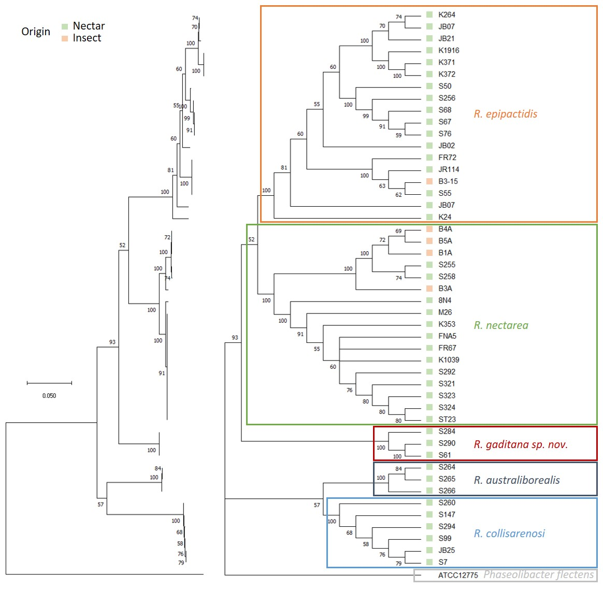

# **Study of the contribution of phylogenetic and environmental factors on the ability of *Acinetobacter* spp. and *Rosenbergiella* spp. to grow in floral nectars**

## About the project

Phylogenetic (Neighbor-Joining tree based on alined gene sequences) and phenotypic (optical density z-scores of culture media) study of *Acinobacter* and *Rosenbergiella* isolates.    

**author**: José Ricardo Morales Poole, Master Program in Computational Biology, Universidad Politecnica, Madrid  
**supervisor of the project**:  Dr. Sergio Álvarez Pérez, Department of Animal Health, Complutense University of Madrid  

## Content

### Main folder

This folder contains R-scripts to run the analysis. All scripts can be launched independently

#### Abt_parts_4_5.r and Rbg_parts_4_5.r

part 4 - Analysis of the population distributions on growth scores by culture medium and duration of incubation

- Shapiro test to determine if populations follow a normal distribution
- Generation of bean plots, violin plots or box-and-whiskers plots
- Analysis of the pairwise correlations between traits and generation of correlograms

part 5 - Principal Component Analysis (PCA) of the growth scores

- Scree plots
- Loading plots
- Score plots

#### Abt_parts_6_7_8.r and Rbg_parts_6_7_8.r

part 6 - Analysis of the pairwise correlations between traits using PICs and generation of new correlograms

- compute phylogenetic independent contrasts (PICs)
- Analysis of the pairwise correlations between traits and generation of correlograms

part 7 - Phylogenetic Anova Tests

part 8 - Phylogenetic Principal Component Analysis

- Scree plots
- Loading plots
- Score plots

#### Abt_parts_9_10_11.r and Rbg_parts_9_10_11.r

part 9 - Phylogenetic Signal metrics

part 10 - Phylogenetic Heatmap

part 11 - Contmap

### Data folder

This folder contains all data required to run R-scripts

#### Phenotypic data

Excel files contain growth scores of *Acinetobacter* (Abt_ANs_data.xlsx) and *Rosenbergiella* (Rbg_ANs_data.xlsx) isolates. Tab 'z-scores' correspond to the z-scores of optical density for each isolate, culture media and 2 different durations of incubation (3 and 7 days).

#### Phylogenetic data

Phylogenetic trees stored in newick format corresponding to Neighbor-Joining trees.

- Rbg_NJ_concatamer_tree.nwk: based on a concatamer of atpD + gyrB + rpoB gene sequences for 47 isolates of *Rosenbergiella* gender
- Abt_NJ_tree_rpoB.nwk: based on a rpoB gene sequences, showing the phylogeny between 43 isolates of *Rosenbergiella* gender

### Result folder

R-scripts result folder
